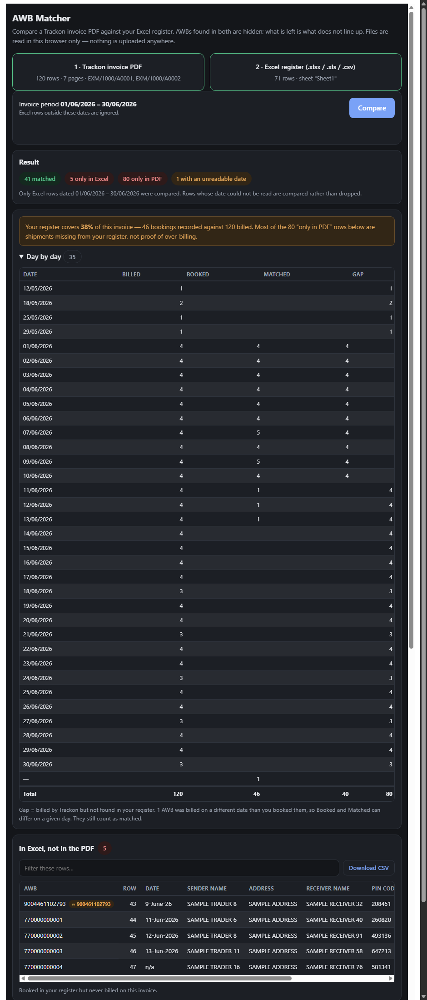

# Courier Invoice Reconciler

Reconciles a courier's tax-invoice PDF against the booking register a shop keeps
in Excel, and shows only the rows that do not line up:

- **In Excel, not in the PDF** — booked, never billed
- **In the PDF, not in Excel** — billed, never booked

Consignment numbers (AWBs) present on both sides are matched and hidden. It is a
static page: no backend, no build step, no database. Every file is parsed in the
browser, so shipment data never leaves the machine it is opened on.



Built against Trackon invoices, but the parser reads the table layout from each
page rather than hard-coding it, so other invoices with the same shape work too.

## Why it is not just a spreadsheet lookup

Three things make this harder than `VLOOKUP`:

1. **The invoice is a PDF**, and its tables are not tagged — they are loose text
   positioned on a page.
2. **The register is kept by hand**, so it mixes date formats, holds more than
   one month, and contains typos.
3. **A raw "billed but not booked" count is ambiguous.** It looks like
   over-billing but is just as likely to be an incomplete register. The tool
   says which.

## How the PDF is read

Not by scraping text layout — by geometry.

Every cell in the invoice is drawn as `x y Td (text) Tj`, and **all cells of one
row share a single Y baseline**. So the extractor groups text items by Y to
rebuild rows, reads each page's header row to learn where the columns sit, and
assigns every cell to the nearest column by its starting X.

Reading the header per page matters: "Additional Charges" tables carry a
`Consignee` column that "Standard" tables do not, so the column map is not fixed.

Two quirks the fixtures pin down, because both appear in real invoices:

- A continuation page can hold rows but **no header row**, so the column map is
  carried forward from the previous page.
- A section banner can be printed at the foot of the **previous** page, so the
  current section is carried forward too.

A note for anyone tempted to use `pdftotext -layout` here: it renders the
Mode/Amount column half a line high, which lands those two values on the
*previous* row's line and silently shifts every mode and amount by one.
`pdftotext -table` gets it right, and reading coordinates directly avoids the
question entirely.

## Matching rules

**Exact match on the trimmed AWB.** Nothing is fuzzy-matched into agreement.

**Only Excel rows inside the invoice period are compared.** The period is read
out of the PDF. Rows outside it are ignored completely — not compared, not
counted, not listed. Registers routinely hold several months in one sheet, and
without this every other month reads as unbilled.

Invoice rows are deliberately *not* date-filtered, so back-billed charges from an
earlier period stay visible. They are tagged with their section.

**Look-alikes are flagged, never auto-matched.** A row is flagged `≈` when an
AWB on the other side differs by exactly one inserted or deleted digit.

Transposition and single-digit substitution were tried and dropped. AWB stickers
are issued in sequence, so near-neighbours are legitimately different shipments:
on the invoice this was built against, substitution produced 396 false pairs and
transposition 124, while the insertion/deletion rule produced exactly one — a
real data-entry error.

**Rows whose date cannot be read are compared, not dropped**, and counted
separately, so nothing disappears silently.

## Reading "only in PDF"

A large "only in PDF" number is not by itself evidence of over-billing; it is
equally consistent with a register that was not kept. The **Day by day** panel
tells you which — one row per date with `BILLED · BOOKED · MATCHED · GAP`, where
`GAP = BILLED − MATCHED` and the Gap column sums to exactly the "only in PDF"
figure. A banner appears when the register covers under 80% of the invoice.

On the invoice this was built against, the register covered 24% of one month
while covering a normal share of the next — a record-keeping gap, not a billing
dispute, and the panel made that obvious at a glance.

`MATCHED` counts AWBs found anywhere in the register rather than on the same day,
so its total agrees with the summary. Consignments booked one day and billed the
next are reported separately as a count.

## Run it locally

```sh
python -m http.server 8000
# http://localhost:8000/web/
```

Opening `web/index.html` directly will not work — `file://` blocks the ES module
and worker loads that pdf.js needs. It has to be served over HTTP.

## Deploy

Copy `web/` to any static host. There is nothing to configure and nothing to run
server-side.

On Apache, keep `web/.htaccess` with it. It carries two directives that matter:

- `AddType text/javascript .mjs` — Apache does not always know the extension,
  and without a JavaScript mime type the browser refuses `pdf.min.mjs`. The page
  then loads and does nothing at all: no error, just a dead button.
- `DirectoryIndex index.html` — if the parent site sets `DirectoryIndex
  index.php`, a subfolder inherits it, finds no `index.php`, and returns 403 even
  though `index.html` is sitting right there.

## Tests

```sh
node tools/test.mjs                  # extraction, matching, coverage
python tools/run-browser-check.py    # the real page, in real Chrome
```

`tools/test.mjs` runs the browser's own pdf.js over the fixture invoice and diffs
all 120 rows field-by-field against the ground truth its generator wrote. It also
covers the CSV and XLSX register paths, date parsing, the look-alike rule, and
the coverage arithmetic.

`tools/run-browser-check.py` loads the real page in headless Chrome, feeds both
files through the file inputs as a user would, clicks Compare and asserts on what
was rendered — row counts, badges, search, and that the page does not scroll
sideways at 390 px. Add `--screenshot out.png` to capture the finished page.

## Fixtures

The invoices this was built against contain customer names, phone numbers and
bank details, so they are gitignored. `tools/make_fixtures.py` generates
stand-ins that carry no personal data but reproduce every structural quirk the
parsers must handle — two invoices in one file, both table shapes, a headerless
continuation page, a banner on the wrong page, mixed date formats, a duplicate
booking, a 13-digit typo, and rows from a month that must be ignored.

```sh
python tools/make_fixtures.py
```

The generated files are committed, so tests run from a clean clone without
regenerating them.

## Layout

| Path | What it is |
|---|---|
| `web/index.html` | the page: markup and styling |
| `web/app.js` | file loading, rendering, CSV export |
| `web/lib.js` | pure logic — extraction, date parsing, matching, coverage |
| `web/vendor/` | pinned pdf.js 5.4.149 (legacy build) and SheetJS 0.20.3 |
| `extract_awb.py` | CLI that extracts invoice rows via `pdftotext -table` |
| `tools/` | fixture generator and the two test suites |
| `tests/fixtures/` | synthetic invoice, register, and expected output |

`extract_awb.py` predates the browser version and is kept as an independent
second opinion: both extractors are checked against the same fixture, by
different routes, and both reproduce it exactly. If either drifts, the tests fail.

Dependencies are vendored rather than installed from a CDN, so the page works
offline and cannot break because someone else's host went down.

## License

MIT — see [LICENSE](LICENSE).
